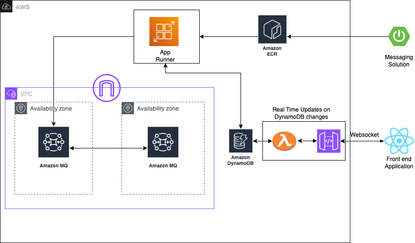
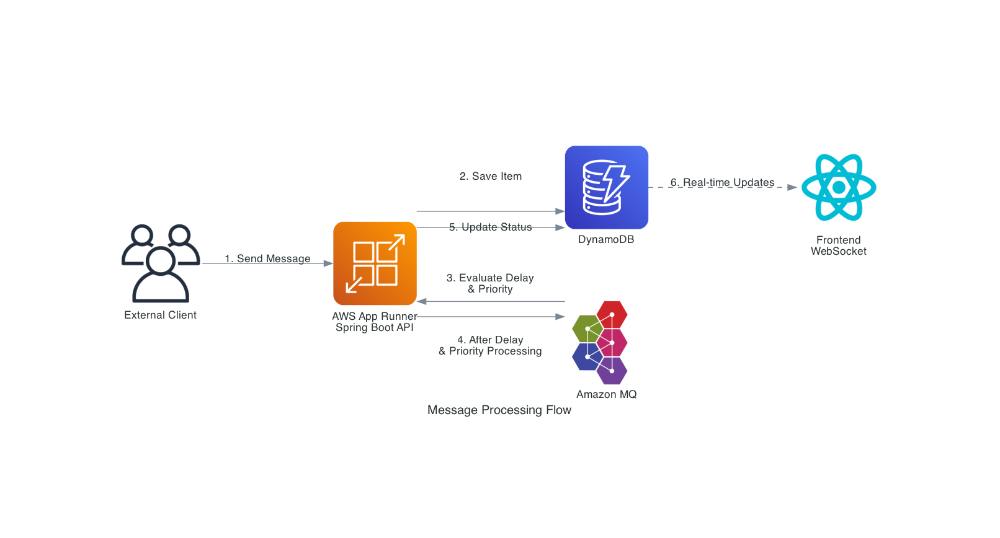
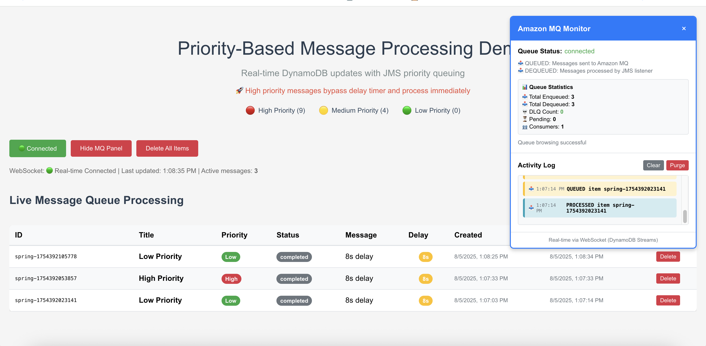
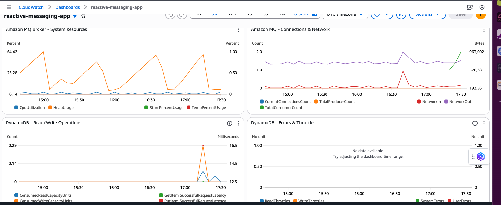

# AWS Prescriptive Architecture: Priority-Based Message Processing with Application-Level Delay



## Executive Summary

This reference architecture demonstrates message processing patterns using AWS managed services. The solution addresses business challenges around delayed processing, message prioritization, and monitoring while maintaining availability and cost optimization.

**Key Business Value:** This architecture reduces operational overhead through managed services while enabling priority-based processing for workflows. The solution provides visibility into processing status and scales based on demand, minimizing infrastructure management complexity.

## Architectural Patterns

### Core Design Patterns

The architecture implements application-level delay processing that decouples timing logic from message infrastructure, enabling business rule implementation. Priority-based message ordering through JMS priority queues ensures processing takes precedence, while event-driven updates via DynamoDB Streams trigger UI notifications. The solution leverages container orchestration through AWS App Runner to eliminate infrastructure management overhead and implements fault tolerance with application and infrastructure-level retry mechanisms. The design provides monitoring across components.

### AWS Service Selection Rationale

The solution selects AWS managed services to optimize for operations and business value. Amazon MQ provides messaging with JMS compatibility and priority queues for message ordering. AWS App Runner offers container orchestration with auto-scaling capabilities, eliminating infrastructure management. DynamoDB serves as the NoSQL database with streaming capabilities for event processing. The frontend leverages CloudFront and S3 for content delivery with origin access control, while API Gateway WebSocket enables communication. CloudWatch provides monitoring and alerting across services for observability.

## Solution Components

### Infrastructure as Code (CDK)
```
infra/
├── modules/                 # Reusable CDK constructs
│   ├── spa_frontend.py     # Global content delivery
│   ├── database.py         # Serverless data layer
│   ├── messaging.py        # Enterprise messaging
│   ├── app_runner.py       # Managed container service
│   ├── monitoring.py       # Observability stack
│   └── simple_websocket.py # Real-time communication
├── stacks/                 # Modular deployment units
└── app_modular.py          # Main orchestration
```

### Application Layers
```
spa-app/                    # Frontend presentation layer
spring-app/                 # Backend business logic
├── Dockerfile             # Container definition
└── src/main/java/         # Enterprise Java patterns
```

### Deployment Automation
```
deploy.sh                   # Infrastructure provisioning
build-and-push.sh          # Container image pipeline
test-api.sh                # Automated testing
config.sh                  # Environment configuration
```

## Implementation Requirements

### Development Environment

The development environment requires AWS CLI configured with deployment permissions, AWS CDK as the Infrastructure as Code framework, and Docker for container image building. The backend application runs on Java 17+ as the application runtime, while the frontend uses Node.js as the build toolchain. Python 3.8+ supports the CDK development environment for infrastructure provisioning.

### AWS Service Permissions

The solution requires permissions across AWS service categories. Core services include App Runner for container orchestration, Amazon MQ as the message broker, DynamoDB for database operations with streams, and ECR as the container image registry. Frontend and API services encompass S3 and CloudFront for content delivery, API Gateway for WebSocket communication, and Lambda for event processing functions. Security and monitoring services include IAM for identity and access management, Secrets Manager for credential management, CloudWatch for observability, and VPC for network isolation and security.

### Environment Setup
```bash
# AWS CDK installation and bootstrap
npm install -g aws-cdk
aws configure  # Configure credentials and region
cdk bootstrap  # One-time account setup

# Repository setup
git clone <repository-url>
cd messaging-amazonmq-polling

# Python environment for CDK
python3 -m venv venv
source venv/bin/activate
pip3 install -r infra/requirements.txt
```

### Deployment Considerations

Deployment requires consideration of factors. Multi-region deployments need updates to `config.sh` for AWS regions, while account isolation should maintain environments for development, staging, and production workloads. Organizations must verify AWS service quotas before deployment to ensure capacity, and network planning should consider VPC CIDR ranges for multi-environment deployments to avoid conflicts.

### Region Configuration

To deploy the solution in a different AWS region (e.g., changing from `us-east-1` to `eu-central-1`), update the following files:

#### Required File Updates
```bash
# 1. Main configuration file
config.sh                    # Update AWS_REGION variable

# 2. CDK bootstrap (one-time setup)
cdk bootstrap aws://ACCOUNT-NUMBER/eu-central-1

# 3. AWS CLI configuration
aws configure set region eu-central-1
```

#### Configuration Steps
1. **Update config.sh**: Change `AWS_REGION="us-east-1"` to `AWS_REGION="eu-central-1"`
2. **Bootstrap CDK**: Run `cdk bootstrap` for the new region
3. **Verify AWS CLI**: Ensure your AWS CLI is configured for the target region
4. **Deploy**: Run `./deploy.sh` to deploy in the new region

#### Important Notes
- Each region requires separate CDK bootstrapping
- Some AWS services may have different availability in different regions
- CloudFront distributions are global but may have different edge locations
- Ensure your AWS account has the necessary service quotas in the target region

## Deployment Guide

### Automated Deployment
```bash
# 1. Container image build and registry push
./build-and-push.sh

# 2. Complete infrastructure provisioning
./deploy.sh

# 3. Solution validation
./test-api.sh --incremental  # Comprehensive testing
```

### Deployment Validation

Post-deployment validation ensures system readiness through checks. Infrastructure validation confirms stacks deployed, while application health monitoring verifies App Runner service status and availability. Message flow validation tests end-to-end processing capabilities, and monitoring validation confirms CloudWatch dashboards are populated with metrics. Frontend validation ensures the React application is accessible via the CloudFront URL with functionality.

## Technical Architecture



### Presentation Layer

The presentation layer leverages CloudFront as a CDN with S3 origin for performance and content delivery. The user interface consists of a React SPA with WebSocket integration for updates, while Cognito provides identity management for authentication across the application.

### Application Layer

The application layer utilizes containers through App Runner to eliminate infrastructure overhead and complexity. Auto-scaling capabilities provide demand-based scaling without requiring capacity planning, while integration patterns are implemented through Spring Boot with JMS messaging for communication.

### Data Layer

The data layer employs DynamoDB as a database with scaling and streams for event processing. Amazon MQ serves as the message broker with reliability and JMS compatibility, while event streaming through DynamoDB Streams enables data flow throughout the system.

### Cross-Cutting Concerns

Cross-cutting concerns address system-wide requirements through design decisions. Network security is implemented via VPC isolation for the message broker, ensuring communication channels. Observability is achieved through CloudWatch monitoring and alerting across components. Infrastructure as Code using CDK enables deployments and environments, while fault tolerance is implemented through retry mechanisms and dead letter queue handling for error recovery.

## Message Processing Flow

### Request Processing Pattern
1. **API Gateway** → Request routing to App Runner service
2. **Business Logic** → Item creation with priority and delay parameters
3. **Data Persistence** → DynamoDB storage with status tracking
4. **Event Streaming** → DynamoDB Streams trigger real-time notifications

### Asynchronous Processing Pattern
5. **Delay Management** → Application-level timing control
6. **Priority Queuing** → JMS message ordering by business priority
7. **Message Processing** → Enterprise messaging patterns with fault tolerance
8. **Status Updates** → Real-time UI synchronization via WebSocket

### Key Processing Characteristics

The message processing architecture delivers API responses while continuing processing asynchronously, ensuring user experience. Priority ordering ensures messages bypass delays and process first, maintaining SLA requirements. Fault tolerance is achieved through retry mechanisms with dead letter queues for failure handling, while visibility provides UI updates for state changes throughout the processing lifecycle.

## API Design

### Core Business Operations
- `POST /api/items` - Create prioritized processing requests
- `DELETE /api/items/{id}` - Remove items from processing queue
- `GET /api/queue/status` - Monitor message broker health
- `POST /api/queue/purge` - Administrative queue management

### Testing and Validation
```bash
# Priority-based processing validation
./test-api.sh 0 "Critical" "Immediate processing" "High"
./test-api.sh 10 "Standard" "Delayed processing" "Medium"

# Load testing with incremental delays
./test-api.sh --incremental
```

> **⚠️ Important:** Before using `test-api.sh`, ensure the following:
> 1. **Region Configuration**: Update the `REGION` variable in `test-api.sh` to match your deployment region
> 2. **Fallback URL**: Update the fallback `API_URL` in the script to your App Runner service URL
> 3. **AWS CLI**: Ensure AWS CLI is configured for the correct region with `aws configure set region <your-region>`
> 4. **Service Discovery**: The script attempts to auto-discover the service URL from output files or AWS CLI, but manual configuration may be required for cross-region deployments

### API Design Principles

The API design follows patterns where operations return instantly to maintain user interactions. Long-running tasks are handled via messaging infrastructure to decouple processing from user requests, while priority support ensures requests receive attention. Observability endpoints provide monitoring integration for visibility and troubleshooting capabilities.

## Frontend Capabilities



### Real-Time Monitoring

The frontend provides monitoring through WebSocket-driven state synchronization that delivers status updates as processing occurs. Message queue visibility includes broker statistics and activity logs, while processing metrics offer visibility into message flow throughout the system. Priority indicators provide representation of processing order, helping operators understand workflow prioritization.

### Operational Controls

Controls encompass functions for queue management and system controls, enabling operators to maintain system health. The testing interface allows item creation with priority selection for validation scenarios, while connectivity provides fallback to polling if WebSocket connections fail. Design ensures user experience across screen sizes and devices.

### Business Value

The frontend delivers business value through visibility that provides insight into system performance and processing status. Troubleshooting support enables identification of processing bottlenecks, reducing time to resolution. User experience delivers feedback on request status and priority handling, improving efficiency and satisfaction.

## Backend Architecture Patterns

### Enterprise Messaging Integration

The backend implements messaging integration through JMS priority queues that enable message ordering with High priority set to 9, Medium to 4, and Low to 0. Processing utilizes CompletableFuture-based delay management for operations, while message acknowledgment uses CLIENT_ACKNOWLEDGE mode for processing guarantees. Dead letter queue functionality provides handling of processing failures, ensuring system resilience.

### Fault Tolerance Design

Fault tolerance is achieved through retry mechanisms at application level using @Retryable annotations and infrastructure level through RedeliveryPolicy configuration. Backoff implements retry delays to handle failures, while circuit breaker patterns enable degradation under system stress. Recovery mechanisms provide handling of processing failures, maintaining system availability during conditions.

### AWS Integration Patterns

AWS integration patterns leverage container orchestration through App Runner to eliminate infrastructure management overhead. Data access utilizes DynamoDB SDK v2 with connection pooling for database operations, while messaging implements SSL/TLS encrypted Amazon MQ connections. Observability integration provides CloudWatch metrics and distributed tracing for system monitoring and troubleshooting capabilities.

## Operational Automation

### Infrastructure Management

Infrastructure management is streamlined through scripts that handle deployment scenarios. The `./deploy.sh` script provides infrastructure provisioning with dependency management, ensuring resource creation order. The `./destroy.sh` script enables resource removal with ordering to avoid dependency conflicts, while `./build-and-push.sh` implements a container image pipeline with ECR integration for deployment workflows.

### Testing and Validation

Testing and validation capabilities support system verification through approaches. The `./test-api.sh` script provides API testing with priority scenarios to validate business logic, while `./test-api.sh --incremental` enables load testing with delays for performance validation. The `./run-spring.sh` script facilitates development environment setup for iteration and debugging.

**Configuration Requirements for test-api.sh:**
- Update `REGION` variable to match your deployment region (e.g., `ap-south-1`, `us-east-1`)
- Verify fallback `API_URL` points to your App Runner service endpoint
- Ensure AWS CLI is configured for the target region
- Check that output files exist or AWS CLI can discover the service URL

### Configuration Management

Configuration management is centralized through `config.sh` for environment setup across deployments. The system supports region and account configuration, enabling deployment strategies. Environment parameter management ensures isolation between development, staging, and production environments while maintaining configuration consistency.

## Configuration Management

### Runtime Configuration

Runtime configuration manages system parameters including `DYNAMODB_TABLE_NAME` for data layer table reference, `MQ_BROKER_URL` for message broker SSL endpoint connectivity, `AWS_REGION` for deployment region specification, and `jms.queue.name` for message queue identifier. These parameters enable deployment across environments while maintaining application behavior.

### Environment-Specific Settings

Environment settings ensure isolation between development, staging, and production environments through parameter management. Secrets Manager integration handles configuration data, while CDK parameter passing enables infrastructure-application coordination. This approach maintains security practices while supporting deployment environments with configurations.

## Technology Selection

### AWS Managed Services

The solution leverages AWS managed services to minimize overhead and maximize reliability. App Runner provides container orchestration, eliminating infrastructure management complexity. Amazon MQ delivers messaging capabilities with ActiveMQ 5.18 for JMS compatibility and message ordering. DynamoDB serves as the NoSQL database with streams integration for event processing. CloudFront and S3 create a content delivery network for frontend performance, while API Gateway enables WebSocket communication. CloudWatch provides an observability platform for monitoring and alerting.

### Application Framework

The application framework combines technologies for functionality. Spring Boot 3.2 serves as the Java application framework, providing dependency injection and configuration management. Jakarta JMS offers messaging API with priority support for message processing. React 18 delivers a frontend with capabilities and state management. AWS CDK implements Infrastructure as Code using Python for infrastructure definitions.

### Enterprise Patterns

Patterns ensure reliability and maintainability. Container orchestration through Docker with ECR registry provides deployment artifacts and container management. Fault tolerance is implemented through retry and recovery mechanisms to handle failures. Message acknowledgment uses CLIENT_ACKNOWLEDGE mode for processing guarantees, while dead letter queues provide failure handling to prevent message loss and enable error analysis.

## Priority-Based Processing Architecture

### Business Priority Mapping

The system implements a priority mapping that aligns processing with business requirements. High Priority (JMS 9) handles operations requiring processing, ensuring execution for workflows. Medium Priority (JMS 4) manages business operations with processing timelines, balancing throughput with resource utilization. Low Priority (JMS 0) processes background tasks and batch operations during capacity, optimizing system efficiency.

### Processing Characteristics

Priority enforcement is managed by ActiveMQ, which orders messages by JMS priority level regardless of arrival sequence. Messages bypass application-level delays, ensuring processing for operations. This processing order is maintained, providing behavior for operations. The business value includes attention for business processes, system resource allocation based on business importance, and processing order for operations.

### Architectural Benefits

The priority-based architecture delivers processing with priority-based ordering, ensuring behavior across system conditions. Business alignment is achieved by matching priority levels with business priority requirements, creating integration between business needs and implementation. Resource optimization ensures tasks receive processing attention, while SLA compliance is maintained through items meeting timing requirements.

## Real-Time Monitoring Dashboard

### Operational Visibility

The monitoring dashboard provides visibility through message flow metrics that track enqueue and dequeue statistics across priority levels. Priority processing indicators offer representation of priority-based processing, enabling operators to understand workflow handling. System health status monitoring includes broker connectivity and performance metrics, while an activity timeline maintains a log of processing events for audit and troubleshooting purposes.

### Administrative Controls

Controls enable system management through queue management capabilities that include purge and reset functions for testing scenarios. System monitoring provides visibility into message broker health and performance characteristics, while troubleshooting support enables identification of processing bottlenecks and performance issues.

### Business Value

The monitoring capabilities deliver business value through operations that enable monitoring and issue identification before they impact business operations. Performance optimization is achieved through insights that support capacity planning and resource allocation decisions. Troubleshooting efficiency is enhanced through problem identification and resolution capabilities, reducing time to recovery and minimizing business impact.

## Observability Strategy



### CloudWatch Integration

CloudWatch integration provides a monitoring dashboard that encompasses system components for observability. Application performance monitoring tracks App Runner CPU, memory, and request metrics to ensure container performance. Message broker health monitoring includes Amazon MQ queue depth, throughput, and broker status for messaging system visibility. Data layer metrics cover DynamoDB operations, throttling, and stream processing performance. Communication monitoring tracks WebSocket connection health and Lambda function performance, while error tracking monitors components for fault detection.

### End-to-End Visibility

End-to-end visibility is achieved through message processing flow monitoring that tracks each stage of the workflow. Request ingestion monitoring covers API Gateway and App Runner metrics for request handling. Data persistence monitoring tracks DynamoDB write operations and stream triggers for data layer performance. Notification monitoring ensures WebSocket connection health and message delivery reliability. Processing monitoring tracks message queue depth and processing latency for messaging performance. Priority handling monitoring validates priority-based processing order and completion rates, while status update monitoring ensures UI synchronization and user experience metrics.

### Operational Excellence

Operations are maintained through monitoring with alerting for system health degradation, enabling response to issues. Performance optimization utilizes metrics for capacity planning and resource allocation decisions. Troubleshooting support is enhanced through logging and distributed tracing capabilities that enable problem identification and resolution. Business metrics tracking includes priority processing effectiveness and SLA compliance monitoring to ensure business objectives are met.

## Implementation Highlights

### Architectural Decisions

Architectural decisions prioritize business value and operations through design choices. The response pattern ensures API responses while continuing background processing, optimizing user experience without sacrificing functionality. Application-level delay management places business logic control over timing decisions rather than relying on infrastructure limitations. Priority-first processing enables messages to bypass delays and process, ensuring operations receive attention. Message processing through CLIENT_ACKNOWLEDGE mode ensures message delivery guarantees, while fault tolerance implements application and infrastructure retry mechanisms for error handling.

### Enterprise Integration Patterns

Integration patterns establish communication mechanisms throughout the system. Event-driven architecture utilizes DynamoDB Streams to trigger UI updates, ensuring user feedback. Message-driven processing implements JMS listeners with priority-based consumption for message handling. Dead letter queue handling provides failure management, preventing message loss and enabling error analysis. Circuit breaker implementation enables degradation under system stress, maintaining functionality during conditions. Observability integration delivers metrics and distributed tracing for system visibility.

### Key Design Benefits

The architectural design delivers benefits across operational dimensions. Scalability is achieved through managed services that eliminate capacity planning requirements and provide scaling based on demand. Reliability is ensured through retry and recovery mechanisms that handle failures. Performance optimization through priority-based processing ensures SLA compliance for operations. Maintainability is enhanced through Infrastructure as Code that enables deployments and infrastructure changes. Cost optimization is achieved through pay-per-use pricing models with scaling, ensuring resource utilization without over-provisioning.

---

## Additional Resources

Documentation and automation tools support implementation and operations. The AWS Prescriptive Guidance document provides architectural guidance and implementation considerations for deployment scenarios. The deployment guide offers infrastructure provisioning capabilities for deployments. The testing framework enables validation and load testing to ensure system reliability and performance. Configuration management tools provide environment parameter management for deployment across environments and AWS regions.